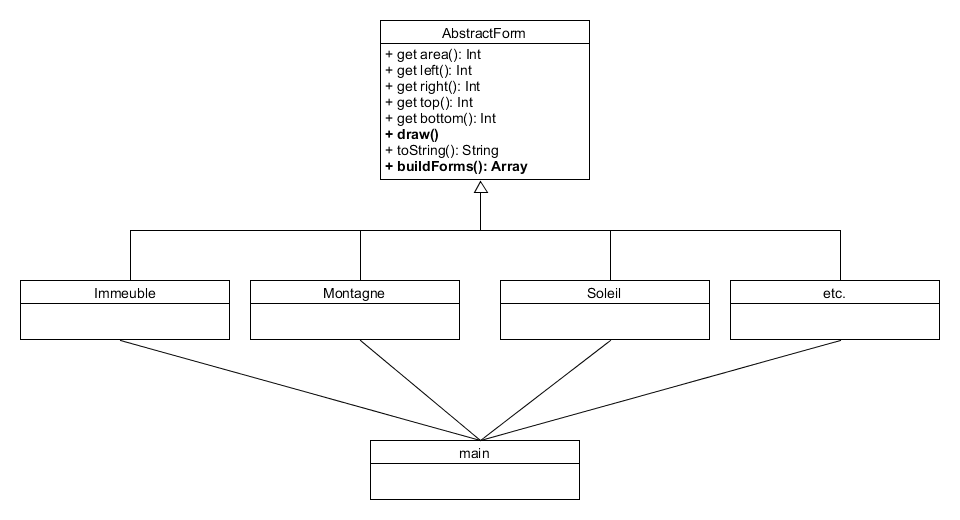

# Virtual Landscape #

[https://github.com/COBOLyte/Virtual-Landscape.git](https://github.com/COBOLyte/Virtual-Landscape.git)

----------

**Virtual Landscape** est un générateur de paysage virtuel. Cette application a été conçu par des apprentis développeurs, avec les objectifs suivants:

- Initiation au **Javascript** et à l'élément HTML **`Canvas`**
- Développement de la créativité
- Mise en situation de la prise en main d'une application préconçue

### Historique ###

**Javascript** (souvent abrégé "JS") est un langage de script léger, orienté objet, principalement utilisé dans les pages web, avec le HTML et le CSS. Il permet de dynamiser les pages en lançant des évènements à des temps déterminés, des animations 2D/3D, etc. Les pages web perdent alors, leur rigidité et leur staticité, au profit de visuels et intéractions plus vives.
[https://developer.mozilla.org/fr/docs/Web/JavaScript](https://developer.mozilla.org/fr/docs/Web/JavaScript)

**La programmation orientée objet (ou POO)** est un modèle de langage s'articulant autour d'objets ou données, plutôt que sur des actions ou de la logique (donc, en opposition à la programmation procédurale). Cela permet la création d'objets, possédant des attributs et méthodes propres à l'objet. Les objets sont considérés comme des instances d'une classe. Le **Java** et le **C++** sont des langages orientés objets, par exemple.
[https://fr.wikipedia.org/wiki/Programmation_orient%C3%A9e_objet](https://fr.wikipedia.org/wiki/Programmation_orient%C3%A9e_objet)

**L'élément HTML `Canvas`** est arrivé avec la dernière version d'HTML, **HTML5**, étant aujourd'hui, le langage de balisage le plus utilisé dans les sites web. Il permet la création de dessins, éléments graphiques et animations. `Canvas` était au départ supporté par Mozilla (Firefox 1.5), avant d'être introduit par la suite, sur Internet Explorer et Chrome (Google). Cet élément consiste en la création de formes géométriques simples ou complexes, couplés à de la composition et de l'animation. Son utilisation dépend de la volonté et de la créativité de l'utilisateur.
[https://developer.mozilla.org/fr/docs/Web/HTML/Element/canvas](https://developer.mozilla.org/fr/docs/Web/HTML/Element/canvas)

## Présentation de l'application ##

### 1. Installation ###

**Virtual Landscape** est conçu sous la forme d'un site web avec du Javascript intégré. L'application nécessite donc d'être placé derrière un serveur HTTP. Pour ce faire, vous pouvez installer [Laragon](https://laragon.org/ "Installer Laragon"), un environnement de développement local.

- Téléchargez l'ensemble des fichiers depuis le dépôt Git. Les fichiers devront être placés dans le dossier `www`, dans le cas de Laragon.
- Veillez à lancer les serveurs HTTP sur Laragon.
 
- Lancez l'application en accédant au répertoire contenant les fichiers, via un navigateur web ou en ouvrant directement le fichier `index.html`.

### 2. Fonctionnement ###

**1:** Génération aléatoire d'un paysage

**2:** Sélection d'un type de paysage

**3:** Enregistrement du paysage + *(émission d'un clic sonore)*

**4:** Rendu du paysage

#### Analyse ####

`index.html` :

Permet l'affichage de la barre de navigation.

      <header>
    

      <ul id="nav">
    <li><a href="#"">&nbsp;Virtual&nbsp; &nbsp;Land&nbsp;</a></li>
    <li><a href="#" onclick="drawAllForms();">&nbsp;&nbsp;&#127922;&nbsp;&nbsp;</a></li>
    <li><a class="hsubs" href="#">&nbsp;&nbsp;All&nbsp;&nbsp;</a>
      <ul class="subs">
    <li><a href="#" onclick="drawThisLand('Rocky');">Rocky</a></li>
    <!--<li><a href="#">Chinese</a></li>-->
    <li><a href="#" onclick="drawThisLand('Urban');">Urban</a></li>
    <!--<li><a href="#" style="pointer-events: none; cursor: default;">(&#128295;&#128296;)</a></li>-->
      </ul>
    </li>
    <li><a href="#" onclick="download_image(); play();">Save Landscape</a></li>
    <audio id="audio" src="audio/camera-shutter-click-01.mp3"></audio>
    <!--
    <li><a class="hsubs" href="#">(composants)</a>
      <ul class="subs">
      </ul>
    </li>
      -->
      

    </ul>
      

      <!-- Template from : http://www.script-tutorials.com/pure-css3-lavalamp-menu/ -->
    </header>

`onclick="drawAllForms();"` permet de lancer la mise en forme du Canvas. Elle est issue d'une fonction, créée dans le fichier `main.js`. Il en va de même pour `onclick="drawThisLand('Rocky');"`, mais lui, permet la génération d'un paysage spécifique.

    <a href="#" onclick="download_image(); play();">
Permet l'enregistrement du canvas, sous forme d'image, grâce à un script, présent dans le même fichier:

    

    <audio id="audio" src="audio/camera-shutter-click-01.mp3"></audio>
La balise `audio` génère un clic sonore. Feature rajouté dans un simple soucis de détail.

Permet la création de l'élément Canvas et l'exportation du fichier `main.js`, nécessaire pour la mise en forme du Canvas.

    
<canvas id="sceneryCanvas"></canvas>

    
    

`main.js` :

Permet l'importation des différentes classes créées dans le dossier `modules`, afin de les utiliser.

    import {Immeuble} from './modules/Immeuble.js';
    import {ArrierePlan} from './modules/ArrierePlan.js';
    import {Route} from './modules/Route.js';
    import {Ballon} from './modules/Ballon.js';
    import {Lampadaire} from './modules/Lampadaire.js';
    import {Soleil} from './modules/Soleil.js';
    import {Palmier} from './modules/Palmier.js';
    import {Ciel} from './modules/Ciel.js';
    import {Etoile} from './modules/Etoile.js';
    import {Lune} from './modules/Lune.js';
    import {Montagne} from './modules/Montagne.js';
    import {Sapin} from './modules/Sapin.js';
    import {Nuage} from './modules/Nuage.js';
    import {Comete} from './modules/Comete.js';
    import {Particule} from './modules/Particule.js';
    import {Neige} from './modules/Neige.js';

Fonctions permettant de rentrer dans un tableau `forms`, les différentes formes issues des classes. **Pour Ajouter/Supprimer une classe, c'est ici qu'il faut agir**.

    function urbanScene() {
      forms = ArrierePlan.buildForms();
      forms = forms.concat(Soleil.buildForms());
      forms = forms.concat(Immeuble.buildForms());
      forms = forms.concat(Route.buildForms());
      forms = forms.concat(Lampadaire.buildForms());
      if (Math.round(Math.random())==0) {
    forms = forms.concat(Ballon.buildForms());
      }
      forms = forms.concat(Palmier.buildForms());
    }
    
    function rockyScene() {
      let snowAppear = false;
      if (Math.round(Math.random()*3)==0) {
    snowAppear = true;
      }
    
      forms = Ciel.buildForms();
      if (snowAppear == false) {
    forms = forms.concat(Etoile.buildForms());
      }
      if (Math.round(Math.random()*3)==0) {
    forms = forms.concat(Comete.buildForms());
      }
      forms = forms.concat(Lune.buildForms());
      forms = forms.concat(Nuage.buildForms());
      forms = forms.concat(Montagne.buildForms());
      forms = forms.concat(Sapin.buildForms());
      if (snowAppear == true) {
    if (Math.round(Math.random())==0) {
      forms = forms.concat(Particule.buildForms());
    } else {
      forms = forms.concat(Neige.buildForms());
    }
      }
    }

Construction des formes.

    function buildForms() {
      let numLand = Math.round(Math.random());
      if (numLand == 0) {
    urbanScene();
      } else {
    rockyScene();
      }
      return forms;
    }

Mise en forme du rendu sur le canvas.

    function drawAllForms() {
      drawForms(buildForms());
    }

Fonctions nécessaires pour permettre la sélection du type de paysage.

    function chooseLand(whichLand) {
      if (whichLand === 'Rocky') {
    rockyScene();
      } else if (whichLand === 'Urban') {
    urbanScene();
      }
      return forms;
    }

    function drawThisLand(whichLand) {
      chooseLand(whichLand);
      drawForms(chooseLand(whichLand));
    }

`Soleil.js`, un exemple de classe, possible de créer :

    import {AbstractForm} from './AbstractForm.js';
    
    class Soleil extends AbstractForm {
    
      constructor(x = 0, y = 0, width = 0, height = 0, fillColor = '', strokeColor = '', strokeWidth = 0, pesanteur = false) {
    super(x, y, width, height, fillColor, strokeColor, strokeWidth, pesanteur);
    }
    
    draw(ctx) {
    ctx.save();
    
    ctx.beginPath();
    function randomColor() {
      let backColor = ['#'];
      for (let i=1; i<7; i++) {
    const colorCodeRepl = [0,1,2,3,4,5,6,7,8,9,'A','B','C','D','E','F'];
    let code = Math.random()*15;
    code = Math.round(code);
    backColor.push(colorCodeRepl[code]);
    }
    backColor = backColor.join('');
    return backColor;
    }
    
    ctx.fillStyle = randomColor();
    ctx.lineWidth = this.strokeWidth;
    let xDepart = this.x;
    let yDepart = this.y;
    let rayon = this.width;
    
    ctx.arc(xDepart, yDepart, rayon, 0, Math.PI * 2, true);
    
    ctx.globalAlpha = 0.1;
    
    ctx.shadowColor = ctx.fillStyle;
    ctx.shadowBlur = 15;
    
    for (let i = 0; i < 6; i++) {
    ctx.arc(xDepart, yDepart, 25 + (rayon/2) * i, 0, Math.PI * 2, true);
    ctx.fill();
    }
    
    ctx.fill();
    ctx.closePath();
    ctx.restore();
    }
    
    static buildForms() {
    let leSoleil = new Soleil(window.innerWidth/2, window.innerHeight/10, 50, window.innerHeight, '', '', 1, false);
    let forms = [leSoleil];
    return forms;
    }
    
    }
    
    export {Soleil};

### 3. Screenshots ###

Plusieurs exemples de paysages obtenables.
 

 

## Rapport de projet ##

### 1. Contexte ###

Le projet **Virtual Landscape** consistait en la prise en main d'une petite application Javascript, afin de l'améliorer. Elle devait permettre de générer différents paysages, aléatoirement. Cela implique donc que les éléments au sein du paysage généré, doivent être différent, du point de vue de leur nature ou de leur apparence: localisations, formes ou couleurs différentes, par exemple.

### 2. Organisation ###

**Langages utilisés:** JS, HTML, CSS

**Logiciels utilisés:** Sublime Text, Laragon

Ce projet à été réalisé en solitaire, car il en a été jugé faisable, suite à une réflexion sur la capacité de travail et le temps nécessaire pour le réaliser. De plus, il a été jugé pertinent que l'acquisition de compétences en **Javascript** et **Canvas** en solitaire, permette une meilleure consolidation des notions en vigueur.

En phase de pré-production, il avait été jugé qu'un apprentissage des notions élémentaires liés au JS était nécessaire. Cela a permit une compréhension plus aisée de l'application, avant de commencer à élaborer ces premières classes.  Toutefois, il est possible de dire que les notions plus approfondies (`Case`, évènements, etc.), non présent dans le code de base n'étaient pas utiles, dans le contexte de ce projet. Aucune de ces notions n'a été utilisé. De plus, cette phase fut très chronopage *(détails dans la partie Synthèse)*.

L'imagination des paysages demandait de l'inspiration. De ce fait, des recherches sur internet avaient été menés, afin d'en puiser des idées. Plusieurs types de paysages, avec des rendus différents (2D, abstrait, etc.) ont été étudiés. Cela portait sur leur couleur, forme et structure. Grâce à cette phase d'inspiration, plusieurs idées de paysages en découlait. Toutefois, il restait difficile d'imaginer avec exactitude, ce qu'il devait transparaître à l'écran. Dès lors, l'élaboration de **croquis** devenait une évidence. Ces croquis ont beaucoup aidé, malgré leurs aspect très simpliste. Aussi, elles permettent de rendre compte de certaines classes qui ont été abandonnées pendant le développement, par difficulté de dessin de certaines formes ou par leur aspect trop chronophage.
 

### 3. Synthèse ###

Tout d'abord, les difficultés rencontrés lors de la réalisation de ce projet seront abordées.

Il a été jugé nécesssaire une refonte graphique de l'application, afin de la rendre plus ergonomique et appréciable, visuellement. Peu de temps y a été consacré, mais la difficulté réside dans la présence d'un bug graphique, impossible jusqu'à aujourd'hui, à corriger.

La compréhension et apprentissage des notions de base du Javascript (notamment DOM) a été une phase très chronophage. Du fait d'un début développement du projet assez tardif et de la complexité de certaines notions, cette phase aura demandé plus de temps qu'estimé, réduisant alors, le temps disponible dans le développement de l'application.

Dans la même idée, le code de l'application de base a présenté des difficultés de compréhension. En effet, le manque de connaissance du JS et le fait que l'application, à ses débuts, avait été codé par un tierce rendait difficile, un début de développement. C'est de ce passage qu'a découlé la nécessité de se documenter au sujet du JS.

Certains objets qui seraient simples à rendre, directement à la main, ont demandé plus de temps et de rigueur, en `canvas`. Par exemple, la classe `Lampadaire` est une des classes ayant été la plus longue à faire, étant donné le nombre de points approximatifs, à placer.

    let xDepart = Math.random()*window.innerWidth;
    let yDepart = this.y;
    let width = this.height;
    let rayon = this.width;
    ctx.lineWidth = 3.5;
    ctx.beginPath();
    
    ctx.arc(xDepart, yDepart, 15, 0, 3.15, true);
    ctx.fill();
    
    ctx.moveTo(xDepart,yDepart);
    ctx.lineCap = 'butt';
    ctx.lineTo(xDepart,yDepart-width);
    ctx.moveTo(xDepart,yDepart-25);
    
    ctx.moveTo(xDepart-30,yDepart-(width-15));
    ctx.lineTo(xDepart+30,yDepart-(width-15));
    ctx.moveTo(xDepart+15,yDepart-width);
    ctx.lineTo(xDepart-15, yDepart-width);
    ctx.lineTo(xDepart-17.5, yDepart-(width+25));
    ctx.lineTo(xDepart-10, yDepart-(width+25*2));
    ctx.lineTo(xDepart+10.5, yDepart-(width+25*2));
    ctx.lineTo(xDepart+17.5, yDepart-(width+25));
    ctx.lineTo(xDepart+15, yDepart-width);

Malheureusement, subsite encore des bugs, malgré la mise en place d'un certain nombre de correctifs.

Toutefois, la réalisation de ce projet aura été bénéfique, sur bien des aspects.

- Forte expression de sa créativité. L'application pourrait être utilisé à l'avenir, si d'autres idées de paysage venait ou pour expérimenter des classes.
- Expérience gagné sur un langage différent du PHP.
- Gain en maturité, sérieux et rigueur, dans l'élaboration d'un projet de développement.

### 4. Documentation ###
- [https://openclassrooms.com/fr/courses/1916641-dynamisez-vos-sites-web-avec-javascript](https://openclassrooms.com/fr/courses/1916641-dynamisez-vos-sites-web-avec-javascript)
- [https://developer.mozilla.org/fr/docs/Tutoriel_canvas](https://developer.mozilla.org/fr/docs/Tutoriel_canvas)
- [https://www.w3schools.com/html/html5_canvas.asp](https://www.w3schools.com/html/html5_canvas.asp)
- [https://www.youtube.com/channel/UChXy935RrhKDL3EtFcITM5w](https://www.youtube.com/channel/UChXy935RrhKDL3EtFcITM5w)

### 5. Annexes ###
#### Couverture fonctionnelle ####

#### Diagramme de classe ####
